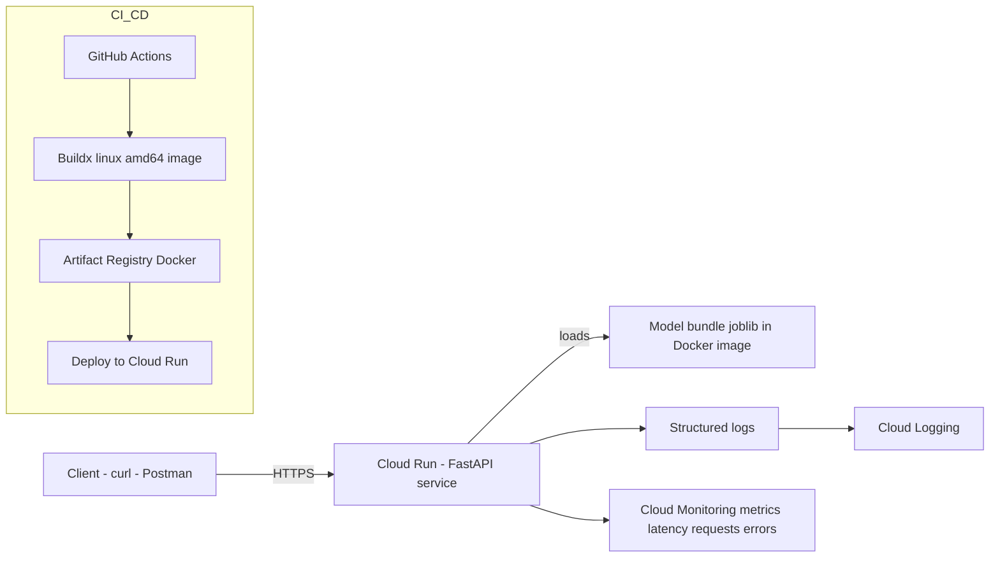

# Production ML API – E-commerce Purchase Prediction


> End-to-end production-grade machine learning service with CI/CD, containerization, cloud deployment and monitoring.  
> Built by an ML Engineer with strong frontend and system engineering background.

---

## Project Overview

This project demonstrates how to design, train, productionize, and deploy a real-world machine learning model as a scalable cloud service.

It includes:

- Data cleaning & feature engineering
- Model training & evaluation
- ML experiment tracking
- Model packaging
- FastAPI inference service
- Docker containerization
- CI with GitHub Actions
- Deployment to Google Cloud Run
- Monitoring (logs, metrics, latency analysis)

The focus of this project is **production readiness**, not just model accuracy.

---

## Business Problem

Predict whether an online user session will result in a purchase.

This enables:

- Marketing optimization
- High-intent user prioritization
- Conversion improvement
- Budget efficiency

**Dataset:** Online Shoppers Purchasing Intention Dataset  
**Task:** Binary Classification

---

## Architecture

Data → Feature Engineering → Model Training →  
Model Packaging (joblib) → FastAPI → Docker →  
Artifact Registry → Cloud Run → Monitoring

The service is stateless and horizontally scalable.



---

## Tech Stack

- Python 3.12
- FastAPI
- scikit-learn
- pandas
- NumPy
- MLflow
- Docker
- GitHub Actions
- Google Cloud Run
- Artifact Registry
- Cloud Monitoring

---

## Model Development

Feature processing:

- ColumnTransformer
- OneHotEncoder
- StandardScaler
- Pipeline

Evaluation metrics:

- ROC-AUC
- PR-AUC
- Precision / Recall
- Confusion Matrix

Final model artifact:

- `models/model_bundle.joblib`

---

## API Endpoints

### Health Check

**GET** `/health`

Response:

```json
{ "status": "ok" }
```

### Prediction

**POST** `/predict`

Example:

```bash
curl -X POST https://ecom-api-427310068062.europe-north1.run.app/predict \
  -H "Content-Type: application/json" \
  -d '{
    "Administrative": 0,
    "Administrative_Duration": 0.0,
    "Informational": 0,
    "Informational_Duration": 0.0,
    "ProductRelated": 1,
    "ProductRelated_Duration": 10.0,
    "BounceRates": 0.2,
    "ExitRates": 0.3,
    "PageValues": 100.0,
    "SpecialDay": 0.0,
    "Month": "May",
    "OperatingSystems": 2,
    "Browser": 2,
    "Region": 1,
    "TrafficType": 1,
    "VisitorType": "Returning_Visitor",
    "Weekend": false
  }'
```

Response:

```json
{
  "probability": 0.546,
  "prediction": 1,
  "threshold": 0.1427,
  "model_version": "v1"
}
```

---

## Local Development

Clone repository:

```bash
git clone https://github.com/vdev-free/ecom-purchase-prediction.git
cd ecom-purchase-prediction
```

Create virtual environment:

```bash
python -m venv .venv
source .venv/bin/activate
```

Install dependencies:

```bash
pip install -r requirements.txt
```

Run API locally:

```bash
uvicorn src.main:app --reload --port 8000
```

Open:

- http://localhost:8000/docs

---

## Run Tests

```bash
pytest -q
```

---

## Docker Build (Local)

```bash
docker build -t ecom-api:local .
docker run -p 8000:8000 ecom-api:local
```

---

## Cloud Deployment (Google Cloud Run)

Build & push image (example):

```bash
docker buildx build \
  --platform linux/amd64 \
  -t europe-north1-docker.pkg.dev/ecom-ml-api/ecom-api/ecom-api:v1
  --push .
```

Deploy to Cloud Run:

```bash
gcloud run deploy ecom-api \
  --image europe-north1-docker.pkg.dev/ecom-ml-api/ecom-api/ecom-api:v1 \
  --allow-unauthenticated \
  --region=europe-north1 \
  --port 8000
```

---

## CI/CD

GitHub Actions pipeline includes:

- Unit tests
- Smoke tests
- Docker build
- Multi-platform support
- Registry push

Ensures reproducible builds and production readiness.

---

## Monitoring & Observability

Cloud Monitoring metrics:

- Request count
- End-to-End request latency (95th percentile)
- Cold start analysis
- Autoscaling events

Observed in tests:

- Cold start ~6–7 seconds
- Warm request latency < 500ms
- Autoscaling verified

---

## What I Learned

Building ML models is the easy part.

Production ML requires:

- Reproducible training and packaging
- Stable inference contracts
- CI/CD automation
- Cloud-native deployment
- Observability and monitoring
- Understanding infrastructure behavior (cold starts, scaling)

The biggest shift was moving from experimentation to system thinking.

My frontend and system engineering background helped in:
- API design and contract stability
- Containerization and deployment workflows
- Monitoring and performance analysis
- Treating ML as a production system, not a notebook

This project reflects my ability to ship reliable ML systems end-to-end.

---

## Future Improvements

- Model versioning endpoint
- A/B testing
- Automatic retraining pipeline
- Infrastructure-as-Code
- Load testing
- Canary deployment

---

## Author

**Volodymyr Udovychenko**  
ML Engineer with strong frontend/system background  
Helsinki, Finland
